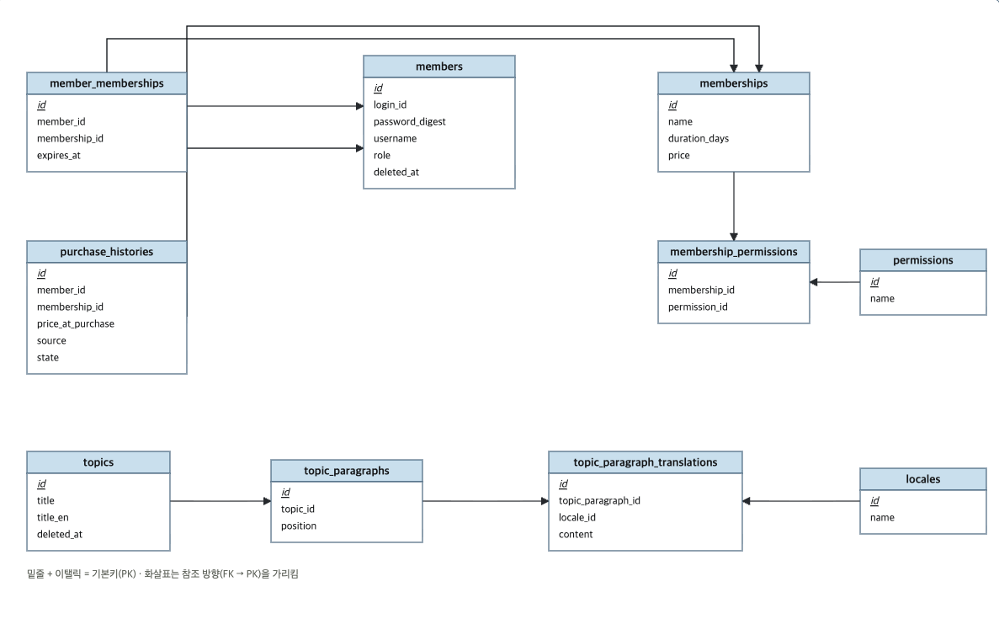

# Ringle AI 튜터

링글(Ringle) 채용 과제 — LLM API 기반 대화형 영어 학습 앱. 멤버십을 보유한 유저가 AI와 실시간 음성으로 대화하며 학습할 수 있는 서비스.

- **Backend**: Ruby on Rails 8.1 (API-only) + PostgreSQL
- **Frontend**: React 19 + TypeScript + Vite
- **AI**: OpenAI Realtime API(WebRTC, 음성 대화) + OpenAI Chat Completions(번역)

```
.
├── backend/   # Rails API (app, config, db, spec 등)
├── frontend/  # React + TypeScript + Vite
└── docs/      # API 명세, 개발 과정 기록 등
```

---

## 1. 실행 방법

### 1.1 사전 준비

- Ruby 3.4.10
- PostgreSQL 17
- Node.js 20+ / npm
- OpenAI API 키

### 1.2 백엔드

```bash
cd backend
bundle install

# DB 생성 + 마이그레이션 (ddl-auto 없음, 항상 수동 실행)
bin/rails db:create db:migrate

# 카탈로그 데이터(권한/언어/멤버십/학습 주제) + 데모 계정 생성
bin/rails db:seed

# OpenAI API 키 등록 (필수 — 아래 "OpenAI 키 설정" 참고)
bin/rails credentials:edit

# 서버 실행 (기본 3000번 포트, 프론트 프록시 대상과 일치해야 함)
bin/rails server -p 3000
```

**OpenAI 키 설정**: `config/credentials.yml.enc`는 "별도 제공되는 key는 없으며
개인 계정으로 구현" 전제에 맞춰 저장소에 커밋하지 않았습니다 — `bin/rails
credentials:edit`을 실행하면 본인 컴퓨터에 `config/master.key` +
`config/credentials.yml.enc`가 새로 생성되고, 빈 편집기가 열립니다. 아래
내용을 입력하고 저장하세요.

```yaml
openai_api_key: sk-...
```

편집기가 안 잡히면 `EDITOR="nano" bin/rails credentials:edit`처럼 직접 지정.
이 키가 없으면 실시간 대화(`POST /api/v1/realtime_sessions`)와 번역
(`POST /api/v1/translations`)이 `502 PROVIDER_ERROR`로 실패한다. 계정에
**크레딧이 없어도** 같은 502로 실패하니, OpenAI 대시보드에서 결제 수단/크레딧을
확인해주세요.


### 1.3 프론트엔드

```bash
cd frontend
npm install
npm run dev
```

기본적으로 `http://localhost:5173`에서 뜹니다. 포트가 이미 점유돼 있으면 Vite가
자동으로 다음 포트(5174 등)를 씁니다. — 어느 포트든 상관없이 `vite.config.ts`의
dev 프록시(`/api` → `http://localhost:3000`)가 그대로 동작하므로 백엔드
CORS 설정을 따로 건드릴 필요는 없습니다.

### 1.4 데모 계정

`bin/rails db:seed`가 아래 3개 계정을 생성한합니다(비밀번호 전부 `password123`).
과제 요구사항상 회원가입/인증 로직 자체는 제외 대상이라 별도 가입 플로우
없이 seed로 바로 로그인 가능한 계정을 제공합니다.

| login_id | 역할 | 상태 | 용도 |
|---|---|---|---|
| `ringle_demo` | 일반 유저 | 멤버십 없음 | 멤버십 구매 플로우, 미보유 상태의 진입 차단 확인 |
| `demo_premium` | 일반 유저 | 프리미엄 멤버십 보유 | 학습 대화(AI 음성 대화) 바로 테스트 |
| `ringle_admin` | 관리자 | - | `/admin/members`에서 멤버십 수동 부여/회수 UI 테스트 |

---

## 2. 설계 및 기술 스택 선정 배경

### 2.1 기술 스택 선정 이유

과제에서 Backend=Rails, Client=TypeScript+React가 고정 스택으로 주어졌기 때문에 사용했습니다.

### 2.2 설계 과정

필수 요구사항 문서와 실제 링글 앱의 AI 스피킹 섹션을 참고하여 설계를 진행했습니다.

1. 개발 환경 구성 및 LLM/STT/TTS API 선정
2. DB 구조 설계
3. 필요 API 설계 및 구현
4. 프론트 목업 페이지 구현
5. 프론트 API 연결 및 realtime AI 대화 구현

순으로 진행하였습니다.

개발 과정에 대한 내용은 `docs/coding_agent_interaction_history.md`에 더 자세히 적어두었습니다.

---

## 3. 백엔드 

### 3.1 DB 다이어그램



- study, converse, analyze 이외의 새로운 권한 추가 및 제거를 고려해 permissions 테이블을 두고 매핑 테이블을 사용했습니다.
- topic의 content에 문단별 해석을 위해 topic_paragraph_translations 매핑 테이블을 두고 사용했습니다. 
  추후 언어 추가를 고려해 권한 처리와 동일하게 locales 테이블을 두고 매핑테이블을 사용했습니다.
- 조회 경로에서 항상 걸리는 조건인 member.deleted_at와 topic.deleted_at에 인덱스를 추가하였습니다.
- 데이터 복원을 고려해 deleted_at 컬럼을 통해 soft delete 방식을 사용했습니다.

### 3.2 서비스 레이어

- 여러 모델에 걸친 하나의 작업 단위는 `ActiveRecord::Base.transaction`으로 묶고, 결제 게이트웨이 같은 외부 API 호출은 트랜잭션 밖에서 하도록 했습니다.
- 외부 API는 생성자 주입 가능한 게이트웨이 클라이언트로 감싸서 교체 가능하게 하였습니다(현재는 테스트 목적으로 사용).
- 에러 응답은 에러 핸들러 헬퍼(`ApplicationController#render_error`)를 사용해 전부 `{ code, message }` 형태로 통일하여 사용했습니다.

### 3.3 멤버십 시스템

- 사용자는 user, admin 두 가지의 Role을 가지고 있다 가정하여 진행했습니다.
- 대화 시 멤버십 권한에 study가 포함되어 있다면 가능하도록 가정하고 진행하였습니다.
- 재구매/재부여 시: 이미 활성 멤버십이 있으면 기존 만료일 + 새 기간으로 update, 없거나 만료됐으면 insert 하게 해주었습니다.      (멤버쉽의 종류가 다를 경우에는 구매하려는 멤버쉽이 오늘 날짜 기준으로 적용이 되는 것을 가정하였습니다.프론트 동의 팝업)
- 멤버십은 basic(study 권한), premium(study, converse, analyze 권한) 두 가지가 있다 가정하고 진행하였습니다.

---

## 4. 프론트엔드 

### 4.1 대화 흐름

1. 주제 소개(제목, 학습 시나리오)와 멤버십 보유 여부를 확인하는 화면을 한 번 거치고,그다음에 실제 AI와 대화하는 화면으로 넘어갑니다(실제 실시간 세션 발급/번역 API 호출 시 백엔드가 다시 한번 권한을 강제합니다).
2. 사용자는 대화할 voice 선택이 가능합니다.
3. 대화 내용은 서버에 저장하지 않고 브라우저(클라이언트) localStorage에만 저장합니다.
4. 유저와 AI가 주고받은 음성도 텍스트와 함께 localStorage에 저장해뒀다가 재생 버튼으로 다시 들을 수 있게 하였습니다.
5. 마이크는 마이크 시작 아이콘을 누른 그 순간에만 실제로 켜지고, 답변완료 아이콘을 누르면 완전히 꺼집니다(실제 앱을 참고). 유저가 말할 수 있는 턴은 20번으로 제한하고, 한 턴에 1분(60초) 제한을 두었습니다.
6. 네트워크 문제 시 realtime API 호출에 필요한 토큰을 최대 3회까지 재발급하고, 실패한다면 수동으로 재연결을 요청하는 버튼이 나오게 하였습니다.
7. 대화 시작 시 prompt에 topic 내용을 포함시켜 보내어 대화 내용을 제한하도록 하였습니다.
8. 다시 시작하기 버튼을 만들어 localStorage의 대화 내용을 지우고 다시 시작 가능하게 하였습니다(브라우저 종료 전까지는 대화가 유지된다는 가정하에 진행하였습니다).

---

## 5. LLM / STT / TTS — OpenAI Realtime API를 선택한 이유

#### 고려 후보
1. **개별 조합**: STT(예: google api) → LLM(예: GPT) → TTS(예: 별도 google api)를 차례로 호출
2. **OpenAI Realtime API**: 하나의 WebRTC 세션으로 음성 입력을 직접 받아 음성+텍스트를 직접 생성하는 네이티브 음성-투-음성 모델.

**Realtime API를 선택한 이유**:

- **지연 시간**: 요구사항의 "응답 지연 시간 단축"을 위해 사용했습니다.
  개별 조합 파이프라인은 각 단계마다 네트워크 왕복이 생기지만, Realtime API는 하나의
  지속 연결 위에서 오디오가 스트리밍되는 즉시 처리되고, 응답도 텍스트/오디오로 스트리밍돼 체감 지연이 훨씬 짧다고 생각했습니다.
  또한 서버가 realtime API 토큰을 발급하고, 프론트는 해당 토큰으로 OpenAI에 WebRTC로
  직접 연결하여 사용합니다(대화 내용을 서버가 관리하지 않는다 가정하고 선택하였습니다). 
  백엔드를 중계 서버로 두지 않아 오디오가 한 번 더 왕복하지 않습니다.

- **VAD 요구사항**: "VAD로 공백 제거 후 STT 요청"은 브라우저 내장 audio API로
  클라이언트가 직접 구현했습니다 — 실시간 오디오 레벨을 측정해 임계값 이하일
  때 마이크 트랙 자체를 꺼서 무음이 전송되지 않게 합니다. Realtime API가
  제공하는 서버 쪽 VAD는 의도적으로 껐습니다 — 응답 자동 생성만
  막을 뿐 침묵 감지 시 오디오 버퍼를 자동으로
  커밋해버리는 동작까지는 막지 못해서, "답변완료" 버튼을 누르기 전에 문장
  중간의 자연스러운 pause만으로 발화가 멋대로 여러 조각으로 쪼개지는 문제가
  있었습니다. 그래서 요청 경계는 "답변완료" 버튼으로만 결정하도록 했습니다.

- 비용은 고려하지 않는다는 가정하여 선택했습니다. 


---

## 6. 테스트 및 검증 방법

### 6.1 백엔드 (RSpec)

```bash
cd backend
bundle exec rspec
bundle exec rubocop
```

모델(검증/연관관계/도메인 메서드) / 서비스(성공·실패·동시성 케이스) / 요청 스펙(HTTP 상태 코드·에러 코드·권한 경계)까지 계층별로 구성.

### 6.2 프론트엔드 (Vitest + React Testing Library)

```bash
cd frontend
npm test
npx tsc -b
npm run lint
npm run build
```

API 클라이언트 / `AuthContext` / 페이지 컴포넌트(폼 제출, 멤버십 게이트, 관리자 페이지 CRUD 플로우) / 훅(WebRTC·오디오 API를 최소 mock으로 대체해 연결 흐름·이벤트 처리·VAD 분기까지 검증)을 커버합니다.

### 6.3 수동 검증

자동화 테스트로 커버하기 어려운 부분(실제 OpenAI 음성 연결, 마이크 권한, 브라우저 오디오 재생)은 개발 중 실제 브라우저에서 데모 계정으로 직접 대화하며 확인했습니다.
