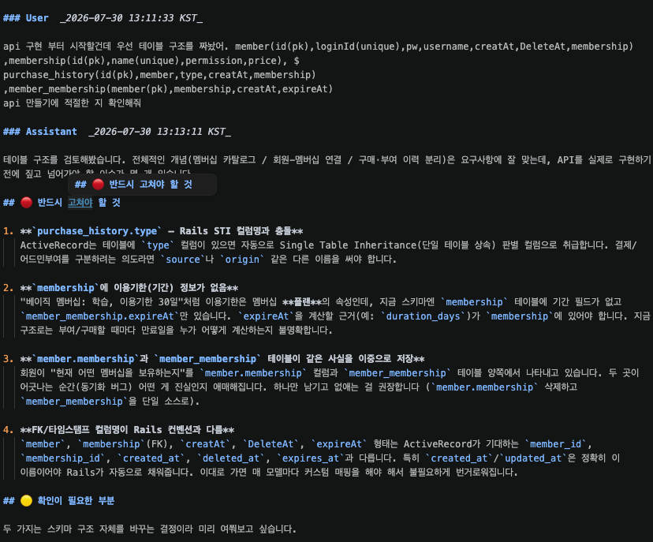
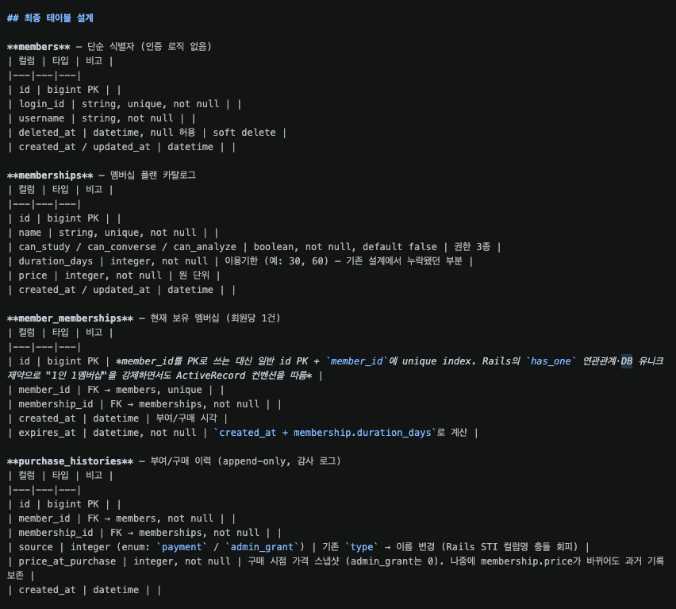
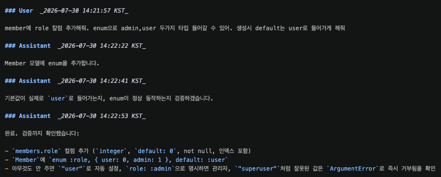
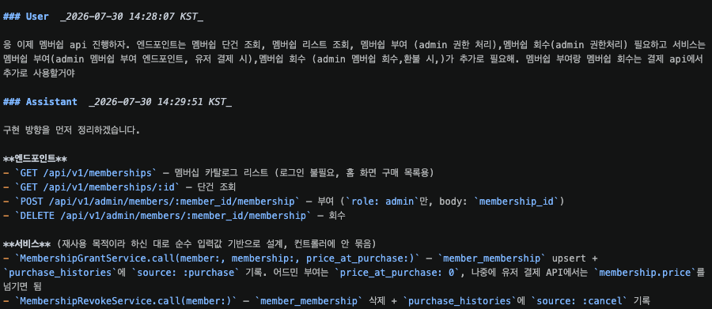
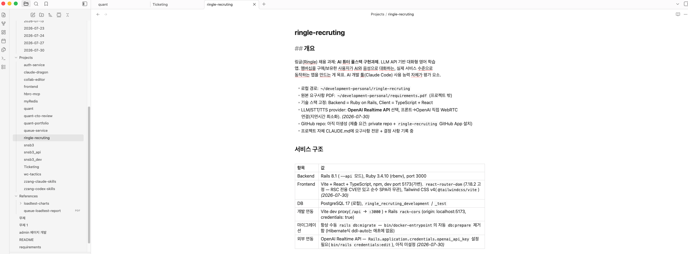
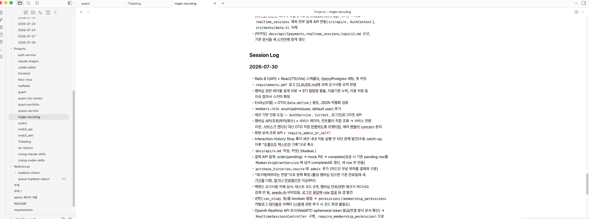
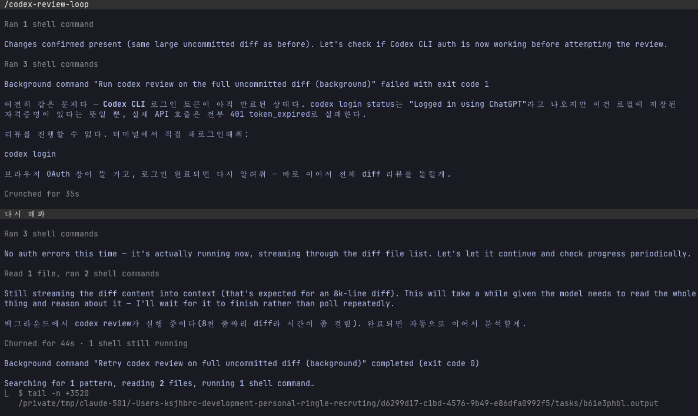
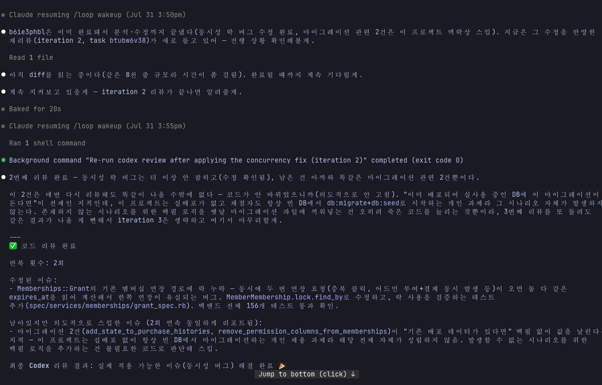

## AI 기반 개발 히스토리

### 사용 도구

claude code, codex, obsidian

### 준비

- 과제의 요구사항을 claude.md 에 명시 후 시작하였습니다.

### 프롬프트 기록

- 프롬프트의 내용을 기록하기 위해 claude code의 stop 훅에 script를 트리거로 설정하여 사용자 입력과 llm의 result 출력 내용을 기록했습니다.

아래는 실제 기록된 예시입니다.

### 작업 관리

- 작업 진행 상황을 관리하기 위해 obsidian에 작업 내용과 todoList를 정리하는 obsidian 스킬을 만들어 사용했습니다. 해당 스킬은 [docs/obsidian.md](obsidian.md) 에서 확인할 수 있습니다.

### 개발 가이드라인

- llm이 코드를 작성할 때의 주의사항을 지정한 스킬을 development-ruby 스킬을 만들어 사용했습니다.

- 해당 스킬에는 api 문서 작성 및 코드 컨벤션, 예외사항 처리, 테스트 코드 작성 및 테스트,api 문서 작성 등이 들어있습니다. 해당 스킬은 [docs/development-ruby.md](development-ruby.md) 에서 확인할 수 있습니다.

### 테스트

- 백엔드는 RSpec으로 모델(검증/연관관계/도메인 메서드), 서비스(성공/실패/동시성 케이스), 요청 스펙(HTTP 상태 코드/에러 코드/권한 경계)까지 계층별로 156개의 테스트를 작성했습니다.
- 프론트엔드는 Vitest + React Testing Library로 API 클라이언트, AuthContext, 페이지 컴포넌트, WebRTC 대화 훅(WebRTC/오디오 API를 최소한의 fake 객체로 대체)까지 68개의 테스트를 작성했습니다.
- chrome claude extension 응 사용하여 웹 환경에서의 e2e 테스트를 진행하였습니다. (음성 대화 플로우 제외)

### 작업 방식

- 작업 단위를 entity 구현, dto 구현, 서비스 구현, 컨트롤러 구현 등 최대한 세분화 하여 진행 했습니다.

### 검증

- 코드 확인 및 엔티티, api 구현 시 직접 db 를 확인 하여 스키마 및 데이터 확인, api 콜을 통한 request,response를 검토하였습니다. 또한 codex-review-loop 스킬을 만들어 사용하여 최대 3 번의 리뷰를 통해 제가 찾지 못한 문제점을 찾을 수 있도록 하였습니다.

